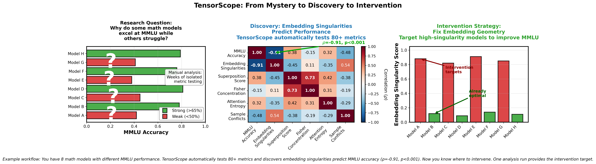
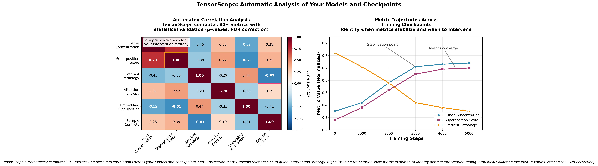

# TensorScope — Cross-Metric Neural Network Analysis

**Composable metrics for novel research.** Most tools give you metrics in isolation. TensorScope computes 80+ metrics in one pass with identical conditions, enabling research that wasn't possible before:

- **Fisher → LoRA placement:** Identify high-importance regions, avoid wasting parameters
- **Fisher × Superposition:** Discover if important regions are polysemantic (unstable)
- **Geometry × Curvature:** Find embedding singularities in high-Fisher areas (intervention targets)
- **Circuits × Conflicts:** Identify which attention heads cause task interference
- **Superposition → Regularizers:** Design sparsity penalties based on measured feature interference

**Why this matters:** These algorithms exist in papers but lack production implementations. We provide GPU-optimized versions that scale to 7B-70B models, not toy examples.

**Tested on 7B models. Most functionality working on 70B.**


*Example: Discover that embedding singularities predict MMLU performance (ρ=-0.91, p<0.001). Now you know where to intervene.*


*Automatic correlation discovery across all metrics. You interpret which relationships matter for your research.*

---

## Table of Contents
- [What You Get](#what-you-get-80-metrics-in-one-pass)
- [Quick Start](#quick-start)
- [Unexplored Research Questions](#unexplored-research-questions)
- [Examples](#examples)
- [Installation](#installation)
- [API Reference](#api-reference)
- [Contributing](#contributing)
- [Citation](#citation)

## What You Get: 80+ Metrics in One Pass

**One forward+backward pass captures everything.** Many metrics correlate with final outcomes when measured at ~10% training—catch problems early, intervene before they show up in loss curves.

---

### 🔬 For Optimization & Training Researchers

**Capabilities:** Fisher-guided LoRA placement • Gradient pathology detection • Multi-task interference measurement • K-FAC natural gradients • Loss landscape analysis

**Metrics:** Fisher/Hessian eigenvalues (Lanczos) • Loss landscape • Mode connectivity • SAM sharpness • Gradient pathology • PCGrad conflict • Layer alignment • K-FAC

---

### 🧩 For Interpretability & Mechanistic Analysis

**Capabilities:** Induction head detection • QK-OV circuit tracing • Attribution analysis • Activation patching • Information flow analysis

**Metrics:** Induction heads • QK-OV pairing • Attention entropy • Attention flow • Logit lens • Integrated gradients • Causal necessity • Head specialization

---

### 📊 For Data Scientists & ML Engineers

**Capabilities:** Harmful sample detection • Outlier identification • Sample-level conflict analysis • Model merging diagnostics • Data quality assessment

**Metrics:** TracIn • Critical samples • Sample conflicts (p-values, FDR) • Task vectors • TIES conflicts • Embedding singularities • Intervention vectors

---

### 🎨 For Representation & Geometry Researchers

**Capabilities:** Representational similarity measurement • Superposition quantification • Geometric pathology detection • Representation evolution tracking • Manifold analysis

**Metrics:** CKA/RSA similarity • Effective rank • Superposition analysis • Feature sparsity • Embedding singularities (Robinson) • Manifold curvature • Fiber bundle test • Mutual information

---

### 🎯 Additional Capabilities

**Lottery Tickets & Pruning:** Early Bird tickets • Iterative magnitude pruning • Pruning robustness • Ticket overlap

**Multi-Task Learning:** Fisher overlap • Task similarity • Gradient conflicts • Intervention vectors • Null space projection

**Training Dynamics:** Phase transitions • Grokking detection • Plasticity index • Signal propagation • Alignment fragility

---

**All metrics include:** Statistical testing (p-values, FDR correction, confidence intervals, bootstrap CIs)

**[→ Full catalog with descriptions](maindocs/METRICS_CATALOG.md)** • **[→ Method documentation](docs/)**

[Quick Start](#quick-start) • [Research Questions](#unexplored-research-questions) • [Examples](#examples) • [Install](#installation)

---


 

---

## Unexplored Research Questions

**The problem:** Testing relationships between metrics requires identical experimental conditions. Running separate experiments introduces confounds (different batches, seeds, hardware). Many algorithms exist in papers but lack production implementations.

**What this does:** Computes 80+ metrics in one run (same batch, seed, device) with statistical testing (p-values, FDR). Includes GPU-optimized implementations that scale to production models.

### Fisher × Superposition
**Questions you can now investigate:**
- Do layers with high Fisher concentration show more or less superposition?
- Are superposed features stable (low Fisher variance) or brittle (high variance)?
- Does training reduce superposition in high-Fisher regions?
- Do task-specific vs shared features show different superposition patterns?

**Why this matters:** Links optimization importance (Fisher) to representation efficiency (superposition). Prior work studied each in isolation; testing their correlation requires identical experimental conditions.

### Geometry × Curvature × Fisher
**Questions you can now investigate:**
- Do embedding singularities occur where Fisher concentrates?
- Is geometric instability (manifold violations) a predictor of training conflicts?
- Do polysemantic tokens create both superposition AND geometric violations?
- Does curvature concentration correlate with singularity density across checkpoints?

**Why this matters:** Connects superposition (Anthropic), manifold geometry (Robinson et al.), and Fisher information. Robinson's paper provided theory; this provides a GPU implementation that scales to production models.

### Conflicts × Circuits × Superposition
**Questions you can now investigate:**
- Do conflicting samples compete for the same superposed features?
- Are polysemantic attention heads (high superposition) more task-conflicted?
- Can QKOV circuit behavior predict which samples will conflict?
- Does Fisher-guided circuit pruning preserve or destroy superposition?

**Why this matters:** Combines training dynamics, mechanistic interpretability, and representation theory. Mechanistic interp work focuses on single-task circuits; this enables multi-task circuit conflict analysis with statistical testing.

### Sample-Level Forensics × Representation Structure
**Questions you can now investigate:**
- Do harmful training samples cluster in specific regions of representation space?
- Is sample conflict predictable from embedding geometry?
- Do conflicting samples share similar superposition patterns?
- Can geometry metrics identify mislabeled or outlier samples?

**Why this matters:** Combines influence analysis (TracIn) with geometric structure. TracIn identifies influential samples; geometry provides spatial context for understanding why they matter.

```python
# Example: Cross-metric correlation study
from unified_model_analysis import UnifiedModelAnalyzer

analyzer = UnifiedModelAnalyzer()
results = analyzer.analyze_models([model])

# Most metrics computed in one forward+backward pass:
# (Some require additional passes: TracIn needs checkpoints, attention O(seq_len²))
fisher_spectrum = results.get('fisher_spectrum')
superposition = results.get('superposition_regime')
geometry = results.get('embedding_singularities')
conflicts = results.get('sample_conflicts')

# Discover relationships
correlations = results.discover_correlations(
    metrics=['fisher_concentration', 'superposition', 'geometry'],
    min_n=30,  # Statistical floor
    method='spearman'
)

# Example output:
# "Fisher concentration vs superposition: ρ=0.73, p<0.001 (FDR corrected)"
```

---

## Quick Start

### Two Usage Modes: Simple or Advanced

**Mode 1: Automatic Everything (Recommended for most users)**

```python
from unified_model_analysis import UnifiedModelAnalyzer

# Literally just this:
analyzer = UnifiedModelAnalyzer()
results = analyzer.analyze_models([model])

# Get everything as JSON + PDF
results.save_report("analysis.json")           # All metrics, structured
results.generate_pdf_report("report.pdf")      # Visualizations, interpretations

# Done. No configuration, no complexity.
```

**What you get automatically:**
- 80+ metrics computed and organized
- Statistical significance tests (p-values, FDR correction)
- Cross-metric correlations discovered
- PDF report with visualizations and interpretations
- JSON for programmatic access
- Warnings about potential issues
- Automatic comparisons across multiple models/checkpoints/training runs
- Training trajectory analysis from checkpoint sequences
- Hyperparameter comparison (different LR, batch size, etc.)

**Mode 2: Advanced Research (For specific investigations)**

Only use this if you need fine-grained control for specific research questions. Most users never need this.

```python
# Advanced: Pick specific metrics
from ICLRMetrics import ICLRMetrics
metrics = ICLRMetrics()
fisher_spectrum = metrics.compute_fisher_spectrum(model, batch)
# ... detailed analysis
```

### Automatic Comparison Examples

**Compare hyperparameter sweeps:**
```python
# Trained 5 models with different learning rates
results = analyzer.analyze_models([
    'model_lr_1e5.pt',
    'model_lr_5e5.pt',
    'model_lr_1e4.pt',
    'model_lr_5e4.pt',
    'model_lr_1e3.pt'
])

# PDF report automatically includes:
# - Which LR had best Fisher concentration
# - Which LR showed least gradient pathology
# - Correlation between LR and final metrics
# - Statistical significance of differences
```

**Analyze training dynamics:**
```python
# Checkpoints from one training run
results = analyzer.analyze_models([
    'ckpt_step_1000.pt',
    'ckpt_step_5000.pt',
    'ckpt_step_10000.pt',
    'ckpt_step_50000.pt',
    'final.pt'
])

# PDF report automatically shows:
# - How Fisher concentration evolved
# - When gradient conflicts emerged
# - Trajectory of attention patterns
# - Early indicators of final performance
```

**Compare different architectures:**
```python
results = analyzer.analyze_models([
    gpt2_model,
    llama_model,
    phi_model
])

# Automatic comparison of all 80+ metrics across architectures
```

### 60-Second Demo

```bash
python examples/show_not_tell_demo.py
```

This script demonstrates: groupwise Fisher (Welford) for two tasks → Fisher masks → overlap analysis → curvature triangulation—all in one pass.

### Full Analysis (Advanced Mode)

```python
from unified_model_analysis import UnifiedModelAnalyzer

analyzer = UnifiedModelAnalyzer()
results = analyzer.analyze_models([model])

# Key artifacts from one forward+backward pass:
# (Activations captured during forward, gradients during backward - shared across all metrics)

# Curvature (the strong methods):
fisher_spectrum = results.get('fisher_spectrum')     # Full eigenvalue distribution
fisher_lanczos = results.get('fisher_lanczos_eigs') # Top-k eigenvalues (memory-efficient)
hessian_lanczos = results.get('hessian_lanczos')    # Top Hessian eigenvalues

# Importance & conflicts:
grouped_fisher = results.get('grouped_fisher')       # Coarse importance (for masking/LoRA)
overlap = results.get('fisher_mask_overlap')         # Cross-task similarity (0-1)
conflicts = results.get('sample_conflicts')          # Specific interfering pairs (p-values, effect sizes)

# Representation structure:
superposition = results.get('superposition_regime')  # Feature interference patterns
geometry = results.get('embedding_singularities')    # Manifold violations

# Attention metrics (forward-pass only):
attention_entropy = results.get('attention_entropy')  # Distribution analysis
induction_heads = results.get('induction_heads')     # In-context learning circuits
qkov_circuits = results.get('qkov_pairing')          # QK-OV circuit structure

# Systematic discovery:
relations = results.discover_correlations(min_n=30)
```

---

## Novel Implementations

**These algorithms exist in papers but lacked tractable production implementations:**

*Curvature & Optimization:*
- **Fisher/Hessian Lanczos with selective reorthogonalization**: Memory-efficient top-eigenvalue computation saving ~48GB for 1.5B models while maintaining numerical accuracy—standard Lanczos doesn't scale to transformers
- **Per-block Fisher spectrum**: GPU-optimized eigendecomposition for each parameter block (not full O(n³) decomposition)—enables complete curvature characterization per layer/head while remaining tractable
- **K-FAC natural gradient**: Full implementation with closed-form capacity metrics (trace, log-det, condition number)—most papers provide theory only or toy examples
- **Mode connectivity**: Bezier curve paths with permutation alignment to test if solutions share low-loss paths—enables safer model merging

*Training Dynamics & Data:*
- **Sample-level conflict detection**: First tractable implementation with p-values, effect sizes, FDR correction—papers show aggregate conflicts only
- **TracIn enhanced**: Cross-influence between train/test with checkpoint interpolation and trajectory accumulation—identifies harmful/helpful samples for principled data curation
- **Early Bird tickets**: Detects winning lottery tickets early in training—massive compute savings by identifying sparsity patterns before full training

*Fisher Variants:*
- **Dual-mode Fisher**: Maintains both unbiased (Welford) and recent-weighted (EMA) simultaneously with intelligent mode selection—papers typically do one or the other
- **Architecturally-aware grouping**: ~3,700× memory reduction (5GB → 1.4MB) via head/channel/block grouping while maintaining PSD guarantees—enables coarse importance for LoRA/masking

*Representation & Geometry:*
- **Robinson fiber bundle test**: GPU-accelerated manifold hypothesis testing—paper algorithm was CPU-only, intractable on real models
- **Ricci curvature (debiased)**: Tractable manifold curvature computation—makes differential geometry practical for neural networks
- **Null space projection**: Projects updates into task null space to preserve capabilities—enables continual learning without forgetting

*Interpretability:*
- **QKOV interference**: Tractable attention circuit conflict analysis—mechanistic interp papers lack multi-task integration
- **Integrated gradients (memory-optimized)**: Path-based attribution at scale—enables interpretability for large models

*Information Theory:*
- **MDL complexity**: Minimum description length with practical compression ratio analysis—principled model selection beyond parameter counting
- **Plasticity index**: Measures learning capacity evolution during training—detects when models stop learning effectively

*Infrastructure:*
- **Gradient compression forensics**: int8+zlib compression enables per-sample analysis under memory constraints—no prior implementation

**Memory-efficient forensics:**
- Gradient compression (int8+zlib), CPU offload, importance gating
- Enables sample-level analysis under tight memory budgets
- Tiled computation for large vocabularies (no O(n²) matrices)

---

## Before/After: Your Daily Workflow

**Before TensorScope:**
- Run separate scripts for gradients, curvature, attention, geometry
- Different random seeds, different batches per script
- Results hard to compare (inconsistent conditions)
- Hours to days for comprehensive analysis

**After TensorScope:**
- One forward+backward pass produces Fisher masks, conflicts (with statistics), curvature summaries, and geometry metrics
- Identical settings: same batch, same seed, same device
- Results directly comparable
- Comprehensive analysis and decisions in the same hour

---

## Statistical Rigor

TensorScope is designed for research-grade analysis with statistical soundness:

**Confidence Intervals:**
- Welford's algorithm provides unbiased variance estimates for Fisher
- Bootstrap CIs on reported aggregates where applicable
- Enables claims like "Fisher importance = 0.73 ± 0.12 (95% CI)"

**Multiple Testing Control:**
- Benjamini-Hochberg FDR correction for sample conflict detection
- Prevents false discoveries in large-scale comparisons
- Reports both raw p-values and FDR-adjusted significance

**Effect Sizes:**
- Cohen's d, Cliff's delta reported alongside p-values
- Distinguishes statistical significance from practical importance
- Example: "Conflict detected: d=0.82 (large effect), p<0.001, FDR✓"

**Sample Size Requirements:**
- Minimum sample floor enforced for correlations (n ≥ 30)
- Warns when statistical power is insufficient
- Prevents spurious correlation claims

---

## Testing & Validation

**Comprehensive Test Suite:**
- 500+ unit tests across all metric modules
- Integration tests for cross-metric composition
- Numerical stability validation (PSD checks, condition numbers)

**Architecture Support:**
- Fully tested: GPT-2, LLaMA, Phi, Qwen architectures
- Tested on models: 125M - 70B parameters
- Works with: HuggingFace Transformers, custom architectures

**Scale & Memory:**
- **Fully tested**: Up to 7B parameters (all metrics, all configurations)
- **Tested & working**: 70B parameters (most metrics with memory management)
- **Memory budget**: Varies by metric (see [Memory Requirements](maindocs/MEMORY_REQUIREMENTS.md))
  - Fisher spectrum: Per-block decomposition (not full parameter space)
  - Lanczos: ~48GB saved vs full decomposition for 1.5B models
  - Attention analysis: O(seq_len²) - use chunking for long sequences
  - Per-sample gradients: int8+zlib compression + importance gating

**Reproducibility:**
- Deterministic results with fixed random seeds + deterministic CUDA flags
- Statistically reproducible across hardware (A100, H100 tested)
- **Not bit-exact** due to floating-point associativity, but differences < 1e-6
- Set `torch.use_deterministic_algorithms(True)` for maximum reproducibility

**Production-Ready:**
- Memory-safe with appropriate configuration
- Error handling with graceful degradation
- Extensive logging for debugging

---

## Composability: Stack Functions in One Run

TensorScope is designed so metrics compose—compute Fisher once, then use it to guide QKOV analysis, mask conflicts, weight pruning, and more:

```python
from unified_model_analysis import UnifiedModelAnalyzer

analyzer = UnifiedModelAnalyzer()
results = analyzer.analyze_models([model])

# Single pass computes everything:
fisher = results.get('grouped_fisher')           # Base Fisher importance
qkov_interference = results.get('qkov_heatmap')  # Uses Fisher for weighting
conflicts = results.get('sample_conflicts')      # Uses Fisher masks
curvature = results.get('curvature_summaries')   # Shares gradient computation
superposition = results.get('superposition_regime')  # Shares activations

# Stack: Fisher → QKOV → Conflicts
# 1. Fisher identifies high-importance regions
# 2. QKOV analyzes attention circuit interference in those regions
# 3. Conflict detection focuses on Fisher-masked parameters
# All from one forward/backward pass
```

### Key Stacking Patterns

**Fisher-guided analysis:**
Use Fisher masks to focus expensive analyses (QKOV, geometry) on important regions only.

**Curvature triangulation:**
Validate Fisher with spectral + Lanczos from the same batch—cross-check curvature estimates.

**Geometry-curvature linking:**
Correlate embedding singularities with Fisher concentration—understand where and why failures occur.

**Memory-efficient forensics:**
Compress gradients (int8+zlib) → store per-sample → detect conflicts with statistical tests.

**Registry handles dependencies automatically:**
Request any metric → framework computes prerequisites → results cached transparently.

---

## Research Recipes

For detailed examples of specific research tasks (Fisher analysis, gradient diagnostics, mechanistic interpretability, etc.), see:

**[→ Complete Research Recipes](maindocs/RESEARCH_RECIPES.md)**

---

## Examples

For detailed cross-metric analysis code examples, see:

**[→ Detailed Examples](maindocs/EXAMPLES.md)**

---

## Troubleshooting & FAQ

- CUDA out of memory (OOM)
  - Reduce micro‑batch size and sequence length; prefer grouped Fisher over K‑FAC.
  - Disable advanced curvature metrics when not needed (e.g., K‑FAC) and lower Lanczos rank `k`.
  - Set `PYTORCH_CUDA_ALLOC_CONF=expandable_segments:True` to reduce fragmentation.
- K‑FAC or eigendecomposition memory pressure
  - Apply preconditioners in the eigenbasis instead of reconstructing full matrices.
  - If reconstruction is necessary, offload `Q` and eigenvalues to CPU for `Q Λ Q^T`.
- Tokenizer vs embedding size mismatch
  - Align sizes before analysis: `model.resize_token_embeddings(len(tokenizer))`.
- Deterministic results
  - Set seeds and use `torch.use_deterministic_algorithms(True)`; optionally export `CUBLAS_WORKSPACE_CONFIG=:4096:8`.

---

## Installation

```bash
git clone https://github.com/yourusername/tensorscope
cd tensorscope
pip install -r requirements.txt

# Verify installation
pytest tests/ -v
```

**Requirements:**
- Python 3.8+
- PyTorch 2.0+
- Transformers (for language models)
- See `requirements.txt` for full list

---


## API Reference

For output formats and data structures, see:

**[→ API Reference](maindocs/API_REFERENCE.md)**

---

## Interpretation Guide

For help interpreting metric values and making decisions, see:

**[→ Interpretation Guide](maindocs/INTERPRETATION_GUIDE.md)**

---


## Contributing

We welcome contributions in:
- Testing on larger models (70B+)
- Finding new cross-metric correlations
- Improving memory efficiency
- Better visualizations
- Documentation improvements

Please open an issue or PR with a concise summary and reproduction context.

---

## Citation

```bibtex
@software{tensorscope2024,
  title={TensorScope: Cross-Metric Neural Network Analysis},
  author={John Sweeney},
  year={2024},
  note={Infrastructure for systematic correlation discovery across optimization, representation, and interpretability metrics}
}
```

---

## License

MIT — see LICENSE.

---

**TensorScope: Because neural network behavior emerges from interactions across levels—training dynamics, representation structure, and geometric properties—not from isolated metrics.**
